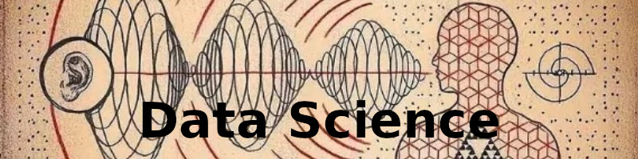

# Portfolio de Projetos - Ciência de Dados

  

# Daniel Kersting
*Project Manager | D.Sc. Eng. Researcher | Mentor* 

A partir das atividades profissionais na área de Ciência dos Materiais junto a Universidade Federal do Rio Grande do Sul (UFRGS), complementados depois com mais estudos e pesquisa junto a Universidade de São Paulo (USP), adquiri credenciais para Gestão de Projetos de P/D, junto ao Centro Tecnológico da Marinha em São Paulo (CTMSP), evoluindo posteriormente para Gestão de Projetos de Implantação Industriais junto ao Centro Industrial Nuclear de Aramar (CINA). Como continuidade deste desenvolvimento profissional, apresento minhas novas credenciais, em desenvolvimento, dentro da área de Ciência de Dados.

**Experiência em:** Python, SQL, Machine Learning, DJANGO.

**Links:**
* [Blog](em implantação)
* [LinkedIn]([(https://www.linkedin.com/in/daniel-kersting-b0895516/])
* [Medium](https://www.medium.com)

## Projetos:

EM ALTERAÇÃO....
* **Como usar o Histograma para Data Science:** https://bit.ly/2L2cMwy
* **Como Implementar Regressão Linear com Python:** https://bit.ly/2Li5pzY
* **Data Science: Investigando o naufrágio do Titanic:** https://bit.ly/2Ubr5SH
* **Como Tratar Dados Ausentes com Pandas:** https://bit.ly/31KWSMN
* **XGBoost: aprenda este algoritmo de Machine Learning em Python:** https://bit.ly/2UbRhws
* **Como criar uma Wordcloud em Python:** https://bit.ly/2OxsphM
* **Como lidar com dados desbalanceados:** https://bit.ly/2ZlaNsV

---
